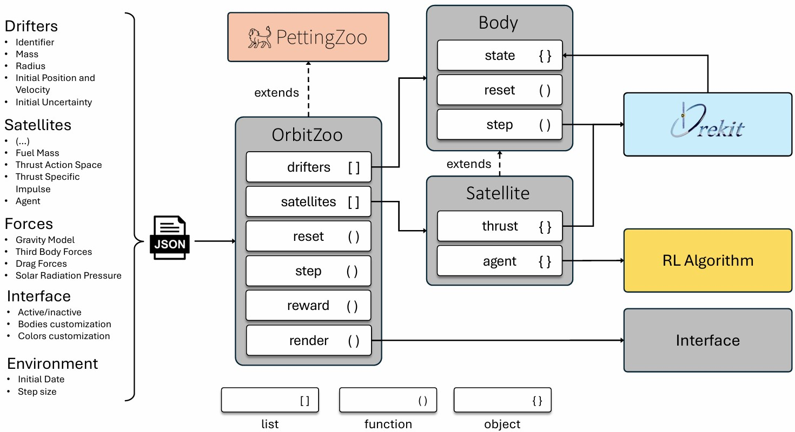

# OrbitZoo

OrbitZoo is an open-source python environment designed to simulate the system dynamics of celestial bodies, offering an interactive 3D interface that showcases realistic orbital mechanics. With multi-agent reinforcement learning (MARL) at its core, OrbitZoo not only provides a powerful platform for simulating space missions but also adheres to RL best practices, making it ideal for developing both real-world and fictional space scenarios. Whether you’re exploring gravitational interactions, training intelligent agents, or visualizing complex orbital systems, OrbitZoo creates a simple, dynamic and immersive experience for any space-related project.



<p align="center">
  
  
  
  
  
</p>

For more videos of OrbitZoo's interface, see:

- [Interface Video](https://www.youtube.com/watch?v=zyRtR-WDzXU)
- [Hohmann Maneuver Mission](https://www.youtube.com/watch?v=Hf9UoVF00Zk)
- [GEO Constellation Mission](https://www.youtube.com/watch?v=95DTFK97Q0A)
- [Chase Target Mission](https://www.youtube.com/watch?v=lBblgsPH7e8)


# Space Dynamics

OrbitZoo simulates the propagation of a system of bodies around Earth, with the space dynamics belonging to Orekit and used here through a Python wrapper. If you want to change the central body (e.g., to the Moon), make sure to change the parameters in the constants.py file (such as the MU constant), representing the constant gravitational parameter of the central body.

Since dynamics are related to the movement of bodies, the fundamental component of OrbitZoo is class **Body**. Each system can have an arbitrary number of bodies.

## Body

The **Body** class is the most fundamental class in OrbitZoo, saving all relevant information that characterizes that body. When creating an instance of **Body**, you can provide the following parameters:

|Parameter|Type|Required|Description|Example|
|-|-|-|-|-|
|name|string|True|Individual identifier of the body.|'asteroid_1'
|initial_state|dict[str, float]|True|Initial state of the body that fully characterizes its position and motion in space. It only accepts Cartesian orbit parameters.| {"x": 4117828.7, "y": 18807373.6, "z": 1291158.1, "x_dot": -4598.9, "y_dot": 1132.5, "z_dot": 223.9},
|initial_state_uncertainty|dict[str, float]|True|Uncertainty (standard deviation) of the previously provided 'initial_state'. | {"x": 10.0, "y": 10.0, "z": 10.0, "x_dot": 0.001, "y_dot": 0.001, "z_dot": 0.001}
|initial_mass|float|True|Initial mass of the body (in kg).| 50.0
|radius|float|True|Radius of the body (in meters), which is assumed to be spherical.|5.0
|save_steps_info|boolean|False|Boolean value indicating if you want the body to save every state at each step in a list (accessible by attribute self.past_states). Default is False.|False

The values provided in 'initial_state' correspond to a mean vector -- $\mu = (x,y,z,\dot{x},\dot{y},\dot{z})$ -- and the values provided in 'initial_state_uncertainty' are used to build the main diagonal of a covariance matrix -- $\Sigma$. When initializing the system, the body's initial position and velocity ($s_0$) will be sampled from a multivariate normal distribution with parameters $\mu$ and $\Sigma$, that is, $s_0 \sim \mathcal{N}(\mu,\Sigma)$.

After creating the body, you have access to much more information regarding the current state of the body by accessing attribute *self.current_state* (which is an instance of SpacecraftState from Orekit). In order to make your work a bit easier, class **Body** already implements some instance methods that are commonly accessed, such as:

|Instance Method|Description|
|-|-|
|get_cartesian_position|Returns an array with the body cartesian position $(x, y, z)$, in meters (where the origin is the center of Earth).|
|get_cartesian_velocity|Returns an array with the body cartesian velocity $(\dot{x}, \dot{y}, \dot{z})$ in meters.|
|get_equinoctial_position|Returns an array with the body equinoctial elements $(a, e_x, e_y, h_x, h_y, M)$.|
|get_keplerian_position|Returns an array with the body keplerian elements $(a, e, i, \omega, \Omega, M)$.|
|get_mass|Returns the current mass of the body, in kg.|
|get_altitude|Returns the distance to the origin (norm of position), in meters.
|get_covariance_matrix|Returns the current state covariance matrix (6x6).
|set_covariance_matrix|Updates the current state covariance matrix (6x6).

Class **Body** also provides some static methods, which are always related to two given bodies:

|Static Method|Description|
|-|-|
|get_distance|Returns the distance between two given bodies, in meters.
|tca|Returns the Time of Closest Approach (TCA) between two given bodies, in seconds. It assumes both bodies are moving in a straight line, without accelerations.
|poc_akella|Returns the Probability of Collision between two given bodies, using Akella's method.
|poc_rederivation|Returns the Probability of Collision between two given bodies, using Ricardo's method (faster than Akella).

Furthermore, class **Body** contains an individual propagator, which is used to not only calculate future positions and velocities of the body, but also the evolution of the uncertainty (covariance matrix, accessible at any time by method get_covariance_matrix). This propagator receives a number of forces that the body is subject to (like gravity of Earth/Sun/Moon, solar radiation pressure, or drag) and according to this is able to predict the state of the body after $\Delta t$ seconds. In order to propagate the body $\Delta t$ seconds in the future, function *step* uses the propagator and automatically updates the *self.current_state* attribute.

## Satellite

Since a body can also have thrusting capabilities, a class that extends from **Body** was created, named **Satellite**. Therefore, in order to create an instance of the class **Satellite**, you also have to provide this additional information:

|Parameter|Type|Required|Description|Example|
|-|-|-|-|-|
|fuel_mass|float|True|Initial mass of the fuel (in kg).|20.0
|isp|float|True|Specific impulse ($I_\text{sp}$) of the engine (in s).| 2500.0

Since Satellites lose fuel mass when performing thrust maneuvers, additional method are provided:

|Method|Description|
|-|-|
|get_fuel|Returns the amount of available fuel (in kg).|
|has_fuel|Returns a boolean value indicating if the satellite still has any fuel.|

Regarding the propagation of a satellite, function *step* can now receive an action (which corresponds to a force) that is added to the propagator before the calculations. No thrust can also be provided.

## Forces

The main force that is present in all systems is gravity. OrbitZoo allows several gravity models, that can be easily changed:

|Model|Description|
|-|-|
|Newtonian Attraction|Simple attraction based on the gravitational parameter of the central body, assuming the body is perfectly spherical. It is the fastest model to compute.|
|Lense-Thirring|Computationally demanding attraction model that performs small corrections to the Newtonian attraction model, based on general relativity. Mainly used for deep space missions.|
|Holmes Featherstone|Representation of the gravitational field of a celestial body, where bodies are not seen as perfectly spherical. It is an algorithm that provides a balance between precision and speed, being the most recommended for most systems.|

OrbitZoo provides some perturbative forces that can be easily added or removed for each body apart from the Earth's gravity. For the sake of simplicity, we consider that all bodies are isotropic, meaning that the attitude (or orientation) of the body does **not** influence the force being applied, only the position. Therefore, we consider that all bodies are spherical. The available forces are split in classes: 

|Class|Arguments|Description
|-|-|-|
|ThirdBodyForce|'name' of the third body.|Force that models the gravitational attraction of a third body. All possible bodies are: 'SOLAR_SYSTEM_BARYCENTER', 'SUN', 'MERCURY', 'VENUS', 'EARTH_MOON', 'EARTH', 'MOON', 'MARS', 'JUPITER', 'SATURN', 'URANUS', 'NEPTUNE', 'PLUTO'
|SolarRadiationForce|'reflection_coefficient' of the body.|Force that models the solar radiation pressure on a given body with a reflection coefficient (reflection_coefficient of 0 indicating that the body is not sensitive to radiation). It also has in consideration shadows created by Earth and Moon.
|DragForce|'drag_coefficient' of the body.|Force that models the drag that a body with a given drag coefficient is subject to (drag_coefficient of 0 indicating that the body is not sensitive to drag).


# Environment

Class OrbitZoo is the environment wraps all this and works as the "interface" for you. After definying all bodies of a system (instances of class **Body** or **Satellite**), you can access the following attributes:

|Attribute|Description|
|-|-|
|drifters|An array containing all bodies of instance **Body** (called 'drifters' because of their natural propagation without the ability of applying thrusts).
|satellites|An array containing all bodies of instance **Satellite**.

Most importantly, it contains standardized methods to control the system propagation:

|Method|Description|
|-|-|
reset| Reinitializes the system to its initial state. If the initial state of some body contains uncertainty, it may generate a new initial state for that body.
step| Propagates the whole system (all bodies) $\Delta t$ seconds to the future.
render| Shows a 3D frame of the current state of the system.
get_body|Receives a body name (string) and returns the body instance (drifter or satellite).

Finally, class **OrbitZoo** is the environment that wraps all this and works as the "interface" with the developer. Everything is accessed through here, whether you want to access a certain Body instance (arrays "drifters" and "satellites"), propagate the system (function "step"), reinitialize the system (function "reset"), or visualize it (function "render"). For reproducibility of initial conditions, the reset function may contain a seed. OrbitZoo is also able to perform parallel propagations for large systems with realistic perturbations. For this, switch the boolean "parallel_propagations" to True.


# How to setup the environment with Anaconda

1. Open Anaconda Prompt
2. Create the environment (using modules with stable versions)
```
conda create -n orbit_zoo numpy=1.24.4 orekit=12.2 pettingzoo=1.24.3 pygame=2.6.0
```
3. Activate the environment
```
conda activate orbit_zoo
```
4. Install torch modules (with CUDA if GPU is available)
```
pip install torch==2.4.1+cu121 torchvision torchaudio --index-url https://download.pytorch.org/whl/cu121
```
5. Install play3d (for interface)
```
pip install play3d==0.1.5
```
6. Unzip orekit-data.zip (and leave it on the same directory)

There might be an error when trying to run the code for the first time (related to a file 'libiomp5md.dll') that can be prevented by deleting the file, located in **...\anaconda3\envs\orbit_zoo\Library\bin\libiomp5md.dll**

# Examples

The **OrbitZoo** environment class can be used simply for orbital dynamics. With it, you can create systems with several bodies with no maneuvering capabilities (called Drifters, which are instances of class **Body**), bodies with maneuvering capabilities (called Satellites, which are instances of class **Satellite**), propagate them in time and visualize it interactively. This is extremely useful for general analysis of dynamics between bodies and realism evaluation.

## Using OrbitZoo classes...

Consider we have a system with two Drifters. In order to create this system in **OrbitZoo**, you need to specify a number of parameters through a JSON file, including the drifters:

```py
params = {
        "drifters": [
            {"name": "asteroid_1",
             "initial_state": {"x": 4117828.7, "y": 18807373.6, "z": 1291158.1, "x_dot": -4598.9, "y_dot": 1132.5, "z_dot": 223.9},
             "initial_state_uncertainty": {"x": 10.0, "y": 10.0, "z": 10.0, "x_dot": 0.001, "y_dot": 0.001, "z_dot": 0.001},
             "initial_mass": 10.0,
             "radius": 5.0,
             "save_steps_info": False},
            {"name": "asteroid_2",
             "initial_state": {"x": 4117828.7, "y": 18807373.6, "z": 1291158.1, "x_dot": 4598.9, "y_dot": -1132.5, "z_dot": -223.9},
             "initial_state_uncertainty": {"x": 100.0, "y": 100.0, "z": 100.0, "x_dot": 0.00001, "y_dot": 0.00001, "z_dot": 0.00001},
             "initial_mass": 10.0,
             "radius": 2.0,
             "save_steps_info": False,
            }
        ],
        "delta_t": 100.0,
        "forces": {
            "parallel_propagation": False,
            "gravity_model": "HolmesFeatherstone",
            "third_bodies": {
                "active": True,
                "bodies": ["SUN", "MOON"],
            },
            "solar_radiation_pressure": {
                "active": False,
                "reflection_coefficients": {
                    "asteroid_1": 0.5,
                    "asteroid_2": 0.5,
                }
            },
            "drag": {
                "active": False,
                "drag_coefficients": {
                    "asteroid_1": 0.5,
                    "asteroid_2": 0.5,
                }
            }
        },
        "interface": {
            "show": True,
            "delay_ms": 0,
            "zoom": 5.0,
            "drifters": {
                "show": True,
                "show_label": True,
                "show_velocity": False,
                "show_trail": True,
                "trail_last_steps": 100,
                "color_body": (255, 255, 255),
                "color_label": (255, 255, 255),
                "color_velocity": (0, 255, 255),
                "color_trail": (255, 255, 255),
            },
            "satellites": {
                "show": True,
                "show_label": True,
                "show_velocity": False,
                "show_thrust": True,
                "show_trail": True,
                "trail_last_steps": 100,
                "color_body": (255, 0, 0),
                "color_label": (255, 255, 255),
                "color_velocity": (0, 255, 255),
                "color_thrust": (0, 255, 0),
                "color_trail": (255, 0, 0),
            },
            "earth": {
                "show": True,
                "color": (0, 0, 255),
                "resolution": 50,
            },
            "equator_grid": {
                "show": False,
                "color": (30, 140, 200),
                "resolution": 10,
            },
            "timestamp": {
                "show": True,
            },
            "orbits": [
                # {"a": 2030.0e3, "e": 0.01, "i": 5.0, "pa": 20.0, "raan": 20.0, "color": (0, 255, 0)},
            ],
        }
    }
```

where the "delta_t" parameter corresponds to the step size (time between steps, $\Delta t$). Other parameters related to the interface can also be manipulated.


After having the initial parameters defined, you can create an instance of OrbitZoo, which will initialize all Orekit components on its background:

```py
env = OrbitZoo(params)
```

From here on out, you can use whatever information that OrbitZoo has according to your needs. For example, if you want to indefinitely propagate the system and visualize it for fun, you might make a script like:
```py
while True:
    env.step()
    env.render() # don't forget to have the value params["interface"]["show"] = True
```

If you want to do Monte Carlo simulations to see the evolution of the position uncertainty of the drifter 'asteroid_1' for the first 300 steps, you can do something like:

```py
import pandas as pd
import matplotlib.pyplot as plt

body = env.get_body('asteroid_1')
data = []
# do 100 simulations
for _ in range(100):
    env.reset()
    # run each simulation for 300 steps
    for step in range(300):
        env.step()
        position = body.get_cartesian_position()
        data.append({
            'step': step,
            'x': position[0],
            'y': position[1],
            'z': position[2]
        })
df = pd.DataFrame(data)
std_by_step = df.groupby('step')[['x', 'y', 'z']].std()
plt.plot(std_by_step)
plt.show()
```

Or yet, test the probability of collision (PoC). In this specific system, you may have noticed that both bodies have the same 'initial_state' ($\mu$), but different uncertainties ($\Sigma$), which means that the initial states will be fairly close to one another (approximately the Time of Closest Approach, TCA). You can create a simulation where you propagate the system backwards in time for a little, and then calculate their distance, TCA and PoC:

```py
# propagate backwards in time
for _ in range(3):
    env.step_back()
chaser = env.get_body('asteroid_1')
target = env.get_body('asteroid_2')
# calculate distance, TCA and PoC
distance = Body.get_distance(chaser, target)
tca = Body.tca(chaser, target)
poc = Body.poc_rederivation(chaser, target)
```

## Extending OrbitZoo classes...

There can be several types of problems we may want to solve. Some problems can have multiple agents, and those agents can see different things and have different rewards. The way the agents learn may differ as well. That is why there's no concrete implementation of RL. However, it's pretty easy to develop learning environments through OrbitZoo, by extending the existing classes. What's said from here on out is the thought process of building a learning environment, but you can think differently!

### Definition of the Problem

For example, imagine we want to train an agent that starts on a given Keplerian orbit - $s_0 = (5500 \text{ km}, 0.20, 5.0º, 20.0º, 20.0º)$  - and the objective is to reach a target orbit - $s' = (6300 \text{ km}, 0.23, 5.3º, 24.0º, 24.0º)$ - in 4 days, by performing a sequence of maneuvers. Since the initial state of the agent has to be given in Cartesian coordinates, we can use a static method from class **Body** to convert Keplerian elements to Cartesian:

```py
Body.print_elements_converted([5_500_000, 0.01, 5.0, 20.0, 20.0, 10.0], 'keplerian')
>>> Cartesian: 6129800.048013737, 7280790.331579311, 415150.31877402193, -5281.077303515858, 4683.916455224767, 543.1013245770663
```

If we want this exact position every time, we define a very small initial uncertainty (done further ahead).

Of course, space is too big, so we must also define a tolerance for each orbital parameter - $\Delta_\text{min} = (10 \text{ km}, 0.01 \text{ rad}, 0.01 \text{ rad}, 0.001 \text{ rad}, 0.001 \text{ rad})$. If the absolute difference of all elements on a given moment to the target elements are smaller (or equal) than the tolerance, then the agent successfully reached the objective: $|s_t-s'| \leq \Delta_\text{min} \rightarrow$ 😃

### Agent

Now we must define mainly two things regarding the agent: the brain that is going to learn how to take intelligent actions (a.k.a. the learning algorithm, like PPO), and what that brain will see to take the actions (a.k.a. the observation, like the current state of the agent).

Since the agent is a **Satellite**, we create a new class that extends from it:

```py
from env import OrbitZoo
from bodies import Satellite
from ppo import PPO

class Agent(Satellite):

    def __init__(self, params):
        super().__init__(params)
        self.ppo = PPO(params["agent"]["device"],
                       params["agent"]["state_dim_actor"],
                       params["agent"]["state_dim_critic"],
                       params["agent"]["action_dim"],
                       params["agent"]["lr_actor"],
                       params["agent"]["lr_critic"],
                       params["agent"]["gae_lambda"],
                       params["agent"]["gamma"],
                       params["agent"]["epochs"],
                       params["agent"]["clip"],
                       True,
                       params["agent"]["action_std_init"])
        
    def get_state(self):
        return self.get_equinoctial_position()
```

For this agent, we're using the PPO algorithm, which receives a bunch of arguments. We can assume that all those arguments will be available in the params["agent"] object. On the init function we are creating the brain of the agent (self.ppo). Everything to do with taking actions and learning is inside this **PPO** instance, and is not relevant here. On the get_state function we define the observation (this value will be returned when functions reset and step are called), which in this case is the equinoctial position (including the longitude).

### Environment

Now we must also extend the environment class **OrbitZoo**, since some methods must be redefined:

```py
class ChangeOrbitEnv(OrbitZoo):

    def __init__(self, params):
        super().__init__(params)
        target = [6300.0e3, 0.23, 5.3, 24.0, 24.0, 10.0]
        orbit = KeplerianOrbit(target[0] + EARTH_RADIUS, target[1], radians(target[2]), radians(target[3]), radians(target[4]), radians(target[5]), 0.0, 0.0, 0.0, 0.0, 0.0, 0.0, PositionAngleType.TRUE, INERTIAL_FRAME, AbsoluteDate(), MU)
        self.target = [orbit.getA(), orbit.getEquinoctialEx(), orbit.getEquinoctialEy(), orbit.getHx(), orbit.getHy()]
        self.tolerance = [10_000.0, 0.01, 0.01, 0.001, 0.001]

    def create_bodies(self, params):
        self.drifters = []
        self.satellites = [Agent(body_params) for body_params in params["satellites"]]  if "satellites" in params else []

    def normalize_states(self, states):
        for satellite in self.satellites:
            state = states[satellite.name]
            state[0] /= self.target[0]
            states[satellite.name] = state
        return states

    def reset(self, seed=None, options=None):
        
        for body in self.drifters + self.satellites:
            body.reset(seed)

        observations = self.normalize_states({satellite.name: satellite.get_state() for satellite in self.satellites})
        infos = {satellite.name: {} for satellite in self.satellites}

        return observations, infos

    def step(self, actions=None):
        satellite = self.satellites[0]
        states = {satellite.name: satellite.step(actions[satellite.name])}
        rewards, terminations = self.rewards(states)
        observations = self.normalize_states(states)
        truncations = {satellite.name: False}
        infos = {satellite.name: {}}
        return observations, rewards, terminations, truncations, infos

    def rewards(self, observations):
        agent_name = self.satellites[0].name
        state = observations[agent_name]
        target = self.target
        tolerance = self.tolerance

        current_a = state[0]
        current_ex = state[1]
        current_ey = state[2]
        current_hx = state[3]
        current_hy = state[4]

        target_a = target[0]
        target_ex = target[1]
        target_ey = target[2]
        target_hx = target[3]
        target_hy = target[4]

        a_diff = abs(target_a - current_a)
        ex_diff = abs(target_ex - current_ex)
        ey_diff = abs(target_ey - current_ey)
        hx_diff = abs(target_hx - current_hx)
        hy_diff = abs(target_hy - current_hy)

        if (
            a_diff <= tolerance[0]
            and ex_diff <= tolerance[1]
            and ey_diff <= tolerance[2]
            and hx_diff <= tolerance[3]
            and hy_diff <= tolerance[4]
        ):
            return {agent_name: 1}, {agent_name: True}

        r_a = a_diff / target_a
        r_ex = ex_diff
        r_ey = ey_diff
        r_hx = hx_diff
        r_hy = hy_diff

        alpha_a = a_diff / target_a
        alpha_ex = ex_diff / target_ex
        alpha_ey = ey_diff / target_ey
        alpha_hx = hx_diff / target_hx
        alpha_hy = hy_diff / target_hy

        reward = -(alpha_a * r_a + alpha_ex * r_ex + alpha_ey * r_ey + alpha_hx * r_hx + alpha_hy * r_hy)
        
        return {agent_name: reward*10}, {agent_name: False}

```
On init, we're creating the target orbit and tolerance. Then, we're changing method create_bodies so that the environment knows that the sattelites are from **Agent** class (not **Satellite** class). On rewards function, we're receiving the agents observations and calculating rewards of those observations (it can also receive the previous observations and actions if needed). Function step receives actions, applies those actions on each body, calls function reward and returns the new observations and rewards. Function reset is also changed so that it returns the needed observations.

### Training

Now that the new classes are created, we can build the training script. Firstly, we define the params object and initialize the newly created environment:

```py
params = {
        "satellites": [
            {"name": "agent",
             "initial_state": {"x": 6129800.048013737, "y": 7280790.331579311, "z": 415150.31877402193, "x_dot": -5281.077303515858, "y_dot": 4683.916455224767, "z_dot": 543.1013245770663},
             "initial_state_uncertainty": {"x": 10.0, "y": 10.0, "z": 10.0, "x_dot": 0.001, "y_dot": 0.001, "z_dot": 0.001},
             "initial_mass": 500.0,
             "fuel_mass": 150.0,
             "isp": 3100.0,
             "radius": 5.0,
             "save_steps_info": False,
             "agent": {
                "lr_actor": 0.0001,
                "lr_critic": 0.001,
                "gae_lambda": 0.95,
                "epochs": 10,
                "gamma": 0.95,
                "clip": 0.5,
                "action_std_init": 0.5,
                "state_dim_actor": 6,
                "state_dim_critic": 6,
                "action_space": [1.4, np.pi, 2*np.pi],
             }},
        ],
        "delta_t": 500.0,
        "forces": {
            "gravity_model": "Newtonian",
            "third_bodies": {
                "active": False,
                "bodies": ["SUN", "MOON"],
            },
            "solar_radiation_pressure": {
                "active": False,
                "reflection_coefficients": {
                    "agent": 0.5,
                }
            },
            "drag": {
                "active": False,
                "drag_coefficients": {
                    "agent": 0.5,
                }
            }
        },
        "interface": {
            "show": True,
            "delay_ms": 0,
            "zoom": 5.0,
            "drifters": {
                "show": True,
                "show_label": True,
                "show_velocity": False,
                "show_trail": True,
                "trail_last_steps": 100,
                "color_body": (255, 255, 255),
                "color_label": (255, 255, 255),
                "color_velocity": (0, 255, 255),
                "color_trail": (255, 255, 255),
            },
            "satellites": {
                "show": True,
                "show_label": True,
                "show_velocity": False,
                "show_thrust": True,
                "show_trail": True,
                "trail_last_steps": 100,
                "color_body": (255, 0, 0),
                "color_label": (255, 255, 255),
                "color_velocity": (0, 255, 255),
                "color_thrust": (0, 255, 0),
                "color_trail": (255, 0, 0),
            },
            "earth": {
                "show": True,
                "color": (0, 0, 255),
                "resolution": 50,
            },
            "equator_grid": {
                "show": False,
                "color": (30, 140, 200),
                "resolution": 10,
            },
            "timestamp": {
                "show": True,
            },
            "orbits": [
                # {"a": 2030.0e3, "e": 0.01, "i": 5.0, "pa": 20.0, "raan": 20.0, "color": (0, 255, 0)},
            ],
        }
    }

env = ChangeOrbitEnv(params)
```

Since we already have all needed methods, we can finally build the logic for training:

```py
episodes = 1000
steps_per_episode = int(60 * 60 * 24 * 4 / params["delta_t"]) # 4 days

low = np.array([0.0, 0.0, 0.0])
high = np.array(params["satellites"][0]["agent"]["action_space"])

time_step = 1
for episode in range(1, episodes + 1):
    start_step = time_step
    current_ep_rewards = {str(satellite): 0 for satellite in env.satellites}
    observations, _ = env.reset(42) # use same seed for reproducibility
    for t in range(1, steps_per_episode + 1):
        try:
            # select actions with policies
            actions = {str(satellite): satellite.ppo.select_action(observations[str(satellite)]) for satellite in env.satellites}
            scaled_actions = {str(satellite): ((np.clip(actions[str(satellite)], [-1,-1,-1], [1,1,1]) + 1) / 2) * high for satellite in env.satellites}
            
            # apply step
            observations, rewards, terminations, _, _ = env.step(scaled_actions)
            
            # save rewards and is_terminals
            for satellite in env.satellites:
                satellite.ppo.buffer.rewards.append(rewards[str(satellite)])
                satellite.ppo.buffer.is_terminals.append(terminations[str(satellite)])
            current_ep_rewards = {str(satellite): current_ep_rewards[str(satellite)] + rewards[str(satellite)] for satellite in env.satellites}
            
            # decay action std
            if time_step % action_std_decay_freq == 0 and env.satellites[0].ppo.action_std > min_action_std:
                for satellite in env.satellites:
                    satellite.ppo.decay_action_std(action_std_decay_rate, min_action_std)

            if terminations[env.agents[0]]:
                print(f'Agent reached target!')
                break

            time_step += 1
        except Exception as e:
            # if there's a propagation error, remove last values from each satellite agent buffer
            for satellite in env.satellites:
                satellite.ppo.buffer.states.pop()
                satellite.ppo.buffer.actions.pop()
                satellite.ppo.buffer.logprobs.pop()
            traceback.print_exc()
            break

        if params["interface"]["show"]:
            env.render()

        if time_step % update_freq == 0:
            for satellite in env.satellites:
                satellite.ppo.update_gae()

    # set the last experience termination flag to True
    if len(env.satellites[0].ppo.buffer.is_terminals) > 0:
        env.satellites[0].ppo.buffer.is_terminals[-1] = True

    # show scores
    for satellite in env.satellites:
        score = current_ep_rewards[str(satellite)]
        print(f'Episode {episode}: {score}')
        # save best model
        if score > best_score:
            best_score = score
            satellite.ppo.save(f"model_checkpoint.pth")
```
