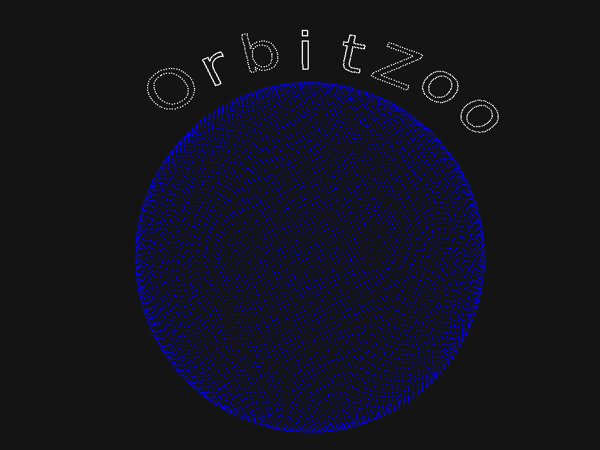
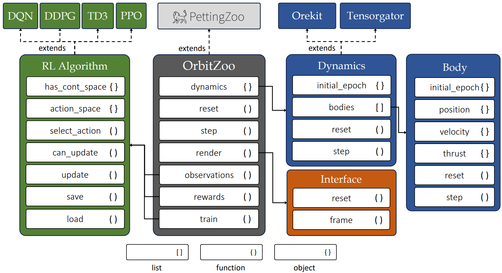
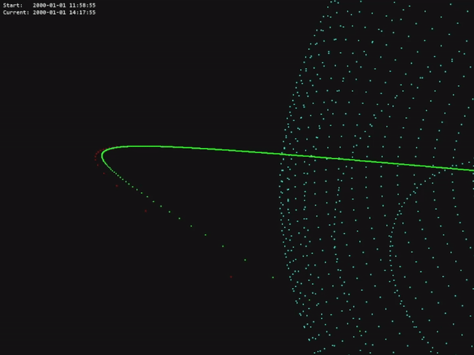
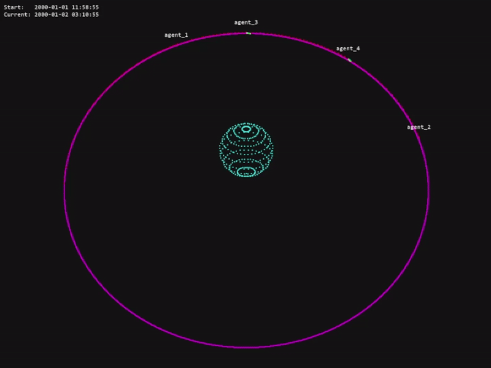
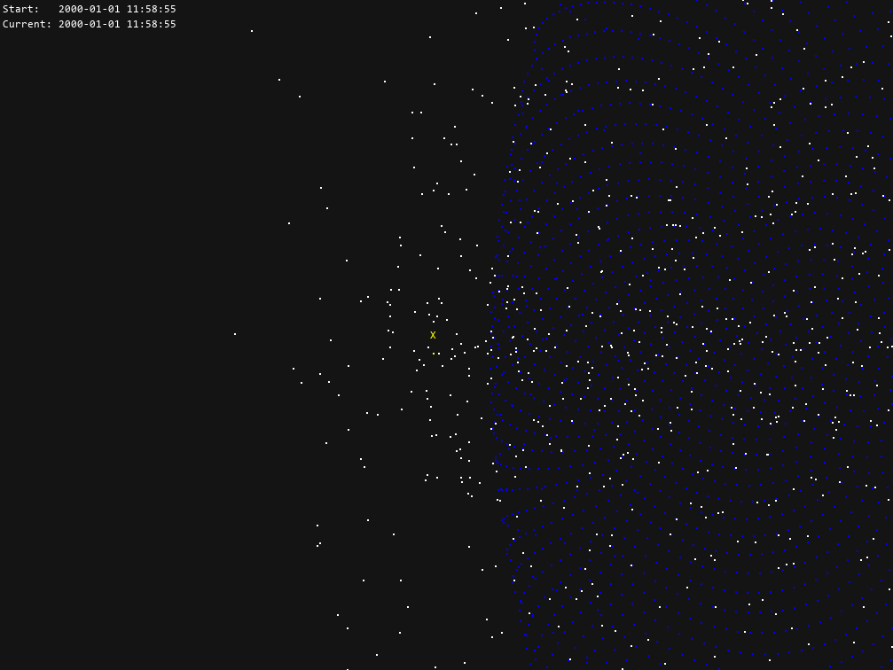
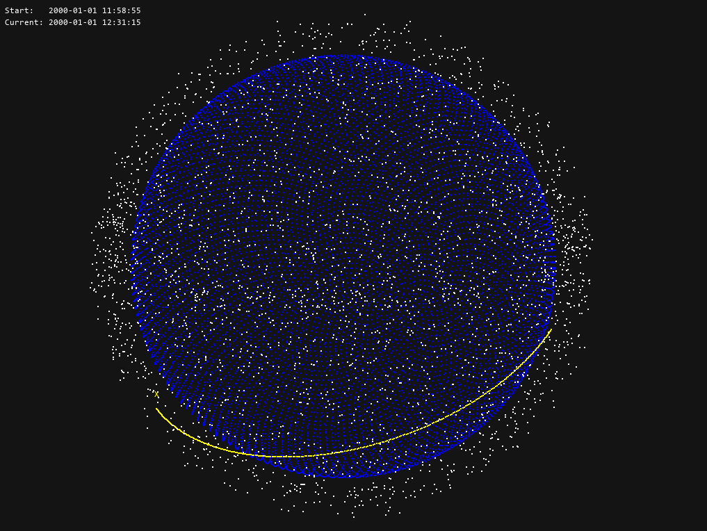
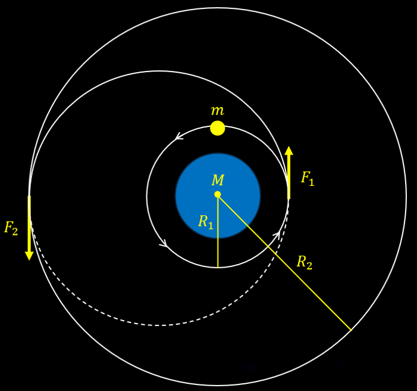
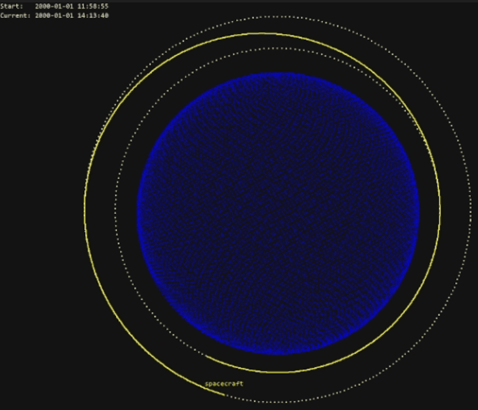

OrbitZoo is an open-source python environment designed to simulate the system dynamics of celestial bodies, offering an interactive 3D interface that showcases realistic orbital mechanics. With multi-agent reinforcement learning (MARL) at its core, OrbitZoo not only provides a powerful platform for simulating space missions but also adheres to RL best practices, making it ideal for developing both real-world and fictional space scenarios. Whether you’re exploring gravitational interactions, training intelligent agents, or visualizing complex orbital systems, OrbitZoo creates a simple, dynamic and immersive experience for any space-related project.



<p align="center">
  
  
  
  
  
</p>

The code for this project is available in the official
[OrbitZoo GitHub repository](https://github.com/orbitzoo/orbit_zoo).

For more videos of OrbitZoo's interface, see:

- [Interface Video](https://www.youtube.com/watch?v=zyRtR-WDzXU)
- [Hohmann Maneuver Mission](https://www.youtube.com/watch?v=Hf9UoVF00Zk)
- [GEO Constellation Mission](https://www.youtube.com/watch?v=95DTFK97Q0A)
- [Chase Target Mission](https://www.youtube.com/watch?v=lBblgsPH7e8)


# OrbitZoo Environment

One key aspect of OrbitZoo is the ability to initialize systems without specifying every aspect of it by making use of default parameters throughout initializations (e.g., mass, radius, drag and reflection coefficients, etc.). Not only are these parameters not relevant for observing the Keplerian motion of bodies (assuming they stay within the same orbit indefinitely), but also facilitate the learning of orbital dynamics for people unfamiliar with it:

|Environment Parameter|Description|Default|
|-|-|-|
|dynamics_library|Type of dynamics behind propagation of bodies. 'tensorgator' provides an analytical method for natural propagation, while 'orekit' provides a numerical propagation for precise propagation and thrust manoeuvers.|'orekit'|
|step_size|Default time to advance the system (in seconds) every time the 'step' function is called.|60|
|initial_epoch|Initial date and time, relevant for the correct modeling of perturbations when using 'orekit'.|current epoch|
|drifters|List of bodies without maneuvering capabilities. Each body must contain information about its initial state, and optionally additional characteristics.|[]|
|spacecrafts|List of bodies with maneuvering capabilities (can only be added when dynamics_library = 'orekit').|[]|
|ground_stations|List of ground stations (stationary bodies on the surface of Earth).|[]|
|render|Bool indicating if the system is to be visualized through the interface (interface is initialized).|False|
|interface_config|Interface configuration/customization.|None|

OrbitZoo directly extends from PettingZoo's *ParallelEnv* class, providing a standardization in terms of available functions for MARL:

|Environment Function|Description|
|-|-|
|reset|Places all bodies of the system in their initial state. Optionally accepts a seed, ensuring reproducibility when initial uncertainty is considered.|
|step|Propagates all bodies of the system. Optionally accepts a 'step_size' and 'actions' (dictionaty containing the thrust for each spacecraft).|
|render|Shows the current state of the system through the interface. Optionally receives a 'save_path', allowing to save the current frame in vectorized format (PDF).|
|observations|Utility function that returns the observation for each agent (i.e., spacecraft) in the system. Only needs to be implemented if OrbitZoo is used for RL.||
|rewards|Utility function that returns the reward for each agent (i.e., spacecraft) in the system. Only needs to be implemented if OrbitZoo is used for RL.|
|train|Standardized function for training agents that uses the implemented 'observations' and 'rewards' functions.|
|find_optimal_params|Standardized function to find optimal RL hyperparameters using Optuna. Each trial corresponds to a single call to the 'train' function.|

After initialization, the user has access to a small number of attributes that contain a lot of information about the system:

|Environment Attributes|Description|
|-|-|
|dynamics|Abstract dynamics attribute that allow access to the physics component of the environment (that ultimately depend on the chosen 'dynamics_library'). Nonetheless, the dynamics provide access to all body instances and functions that can be used for different purposes (e.g., current epoch, distance between bodies, altitude, etc.). When using Orekit, each body  contains a large range of individual characteristics (e.g., current position and velocity uncertainty, mass, and state in different representations), providing a way to calculate the Probability of Collision between two bodies.|
|interface|Interface attribute that, while usually not directly accessed, allows access to the interface component of the environment.|

# Dynamics

All bodies (drifters, spacecrafts and ground-stations) are instances of class **Body**. This class provides the body's current Cartesian position and velocity, and is automatically updated at each step.
This allows for the implementation of different utility functions, such as distance between bodies, altitude, or if bodies have line of sight without Earth's intersection. This information is generic for both dynamics libraries (Tensorgator and Orekit).

The information required for the initialization of each body depends on the dynamics library:
- **Tensorgator**: The user must provide the Keplerian orbital elements (including the anomaly) of the body. At initialization, OrbitZoo creates a matrix containing the initial orbital elements of all bodies. At each step, OrbitZoo updates the current epoch and analytically calculates the Cartesian positions for the current epoch and about a millisecond before (to calculate the instantaneous velocity). Tensorgator makes use of GPU through the Numba library to perform faster computations.

- **Orekit**: The user must provide the Cartesian position and velocity of the body. Optionally, the user can also provide a unique name (required for spacecrafts, used for performing actions/manoeuvers), the initial position and velocity uncertainty (default is practically zero), dry mass, radius, drag and reflection coefficient, and forces (perturbations). For spacecrafts, the user can also provide the initial fuel mass and the thruster specific impulse.
The initial state of the body is a sample from a multivariate normal distribution (with the mean being the initial position/velocity and the covariance being the diagonal matrix with the position and velocity uncertainty).

Ground-stations can be added in both libraries, and the information required is only the Cartesian position indicating the direction of the ground-station (the magnitude of this vector is irrelevant, as the ground-station is always placed at the surface of Earth).

# How to setup the environment with Anaconda

1. Open Anaconda Prompt
2. Create the environment (using modules with stable versions)
```
conda create -n orbit_zoo numpy=1.24.4 orekit=12.2 pettingzoo=1.24.3 pygame=2.6.0
```
3. Activate the environment
```
conda activate orbit_zoo
```
4. Install torch modules (with CUDA if GPU is available)
```
pip install torch==2.4.1+cu121 torchvision torchaudio --index-url https://download.pytorch.org/whl/cu121
```
5. Install play3d (for interface)
```
pip install play3d==0.1.5
```
6. Unzip orekit-data.zip (and leave it on the same directory)

There might be an error when trying to run the code for the first time (related to a file 'libiomp5md.dll') that can be prevented by deleting the file, located in **...\anaconda3\envs\orbit_zoo\Library\bin\libiomp5md.dll**


# Tensorgator: Use Cases

Tensorgator is the go-to option if you want to create a system with the following specifications:
1. Large number of bodies (thousands or millions);
2. Natural motion (no manoeuvers);
3. Fast propagation, but not so accurate.

Some use cases may be related to analysis of surface coverage, or MARL training related to task-assignment between satellites by accounting for limited communication with ground-stations.

In the following system, we are adding 3000 bodies in Low-Earth Orbit (LEO) with random orbits, and we are interested in tracking one specific body (named 'X'):
```py
drifters = [
    {
        'name': 'X',
        'initial_state': [6378e3 + 500e3, 0.01, np.radians(50), np.pi, np.pi, 0]
    }
]
for k in range(2999):
    drifters.append({'initial_state': [
        6378e3 + np.random.uniform(300e3, 1000e3),  # semi-major axis
        np.random.uniform(0, 0.01),                 # eccentricity
        np.radians(np.random.uniform(0, 90)),       # inclination
        np.random.uniform(0, 2*np.pi),              # argument of periapsis
        np.random.uniform(0, 2*np.pi),              # longitude of the ascending node
        np.random.uniform(0, 2*np.pi)               # mean anomaly
    ]})
```
To easily observe the trajectory of this body in the interface, we can configure the body appearence:
```py
interface_config = {
    "body": {
        "X": {
            "show_trail": True,
            "color_body": (255, 255, 0),    # yellow
            "color_label": (255, 255, 0),   # yellow
            "color_trail": (255, 255, 0),   # yellow
            "trail_last_steps": 300         # show previous 300 positions
        }
    }
}
```
To initialize the environment with a default step size of 5 seconds:
```py
env = OrbitZoo(
    dynamics_library='tensorgator',
    step_size=5,
    drifters=drifters,
    interface_config=interface_config,
    render=True
    )
```

To observe the system frozen in time (but with an interactive POV) we simply do an infinite loop to render:
```py
while True:
    env.render()
```

If we want to see the system moving in time, we add the step function:
```py
while True:
    env.step()
    env.render()
```

At any time, you can have the current Cartesian position and velocity of the body:
```py
body = env.dynamics.get_body('X')
print(body.position)
>>> [ 6.80922000e+06 -1.36990243e-09  6.38795995e-10]
print(body.velocity)
>>> [ 1.54693891e-12  4.94251947e+03 -5.89026533e+03]
```

# Orekit: Use Cases

Orekit is the go-to option if you want to create a system with the following specifications:
1. Small number of bodies (dozens or hundreds);
2. Motion with perturbations (drag, solar radiation pressure, gravity field, third-body forces) and manoeuvers;
3. Accurate propagation.

Most use-cases fall within Orekit, specifically regarding RL, as most missions are based on thrust control (orbital transfers, collision avoidance manoeuvers, coordination and competition tasks) that require accurate data.

## Classical Maneuvers

Outside RL, OrbitZoo allows the modelling and testing of classical manoeuvres in a more realistic setting, such as the Hohmann transfer.

The Hohmann transfer consists of placing a spacecraft on an orbit with a higher altitude by saving the most amount of fuel. This happens when the spacecraft applies an instantaneous thrust in two very specific moments (F1 and F2):



While in theory this maneuver is accurate, it also contains irrealistic characteristics, namely the fact that maneuvers are never completely instantaneous and that the spacecraft loses mass after F1, which impacts the force required for F2. The amount of mass that the spacecraft loses is inversely proportional to the thruster specific impulse (a measure of the efficiency of the thruster). OrbitZoo automatically considers these factors, as manoeuvers are applied continuously with time and mass is also continuously lost with time.

To recreate the Hohmann maneuver in OrbitZoo, we first define the spacecraft:
```py
spacecrafts = [
    {
        'name': 'spacecraft',
        'initial_state': [-3529923.947865602, 7042905.715845195, 0.0, 6359.116737768876, 3187.207008809081, 0.0], # Cartesian position and velocity
        'isp': 1000, # thruster specific impulse
        'dry_mass': 1,
        'initial_fuel_mass': 4,
    },
]
```
We can also visualize the initial orbit (with a semi-major axis of 6378+1500 km) and the final orbit (with a semi-major axis of 6378+3000 km):
```py
interface_config = {
    "orbits": [
        {"a": 1500.0e3, "e": 0.001, "i": 0.001, "pa": 0.0, "raan": 0.0, "color": (255, 255, 255)},
        {"a": 3000.0e3, "e": 0.001, "i": 0.001, "pa": 0.0, "raan": 0.0, "color": (255, 255, 255)},
        ],
    "body": {
        "spacecraft": {
            "show_trail": True,
            "trail_last_steps": 3000,
            "color_body": (255, 255, 0),
            "color_label": (255, 255, 0),
            "color_trail": (255, 255, 0),
        },
    },
}
```
Finally, we initialize the environment using steps of 5 seconds:
```py
env = OrbitZoo(
    step_size=5,
    dynamics_library='orekit',
    spacecrafts=spacecrafts,
    interface_config=interface_config,
    render=True
    )
```

For the specifications of this spacecraft, in theory it is needed instantaneous thrusts of F1 = 1512 N and F2 = 1452 N (already considering the loss of mass). If we consider that the spacecraft applies that force for one minute with a constant loss of mass, then F1 = 24.84082 N and F2 = 23.06173 N, and the time of the entire manoeuver is of 3987 seconds.

To verify if these calculations are correct, we can perform the needed manoeuvers through the 'actions' argument in the 'step' function:
```py
sc = env.dynamics.get_body('spacecraft')
print(sc.get_keplerian_elements()[0] - 6378e3) # initial semi major axis
>>> 1499999.6067241011
env.step(step_size=60, actions = {'spacecraft': [0, 24.84082, 0]}) # F1
env.step(step_size=3987) # advance time until F2
env.step(step_size=60, actions = {'spacecraft': [0, 23.06173, 0]}) # F2
print(sc.get_keplerian_elements()[0] - 6378e3) # final semi major axis
>>> 2999626.5240018032
```

The action is a thrust in the RSW representation, so in this case we are applying a thrust in the along-track direction (forward).
To actually see the manoeuver in the interface, we can do something like:
```py
for t in range(3000):
    if t < 12: # F1 for 1 minute (each step is 5 seconds)
        env.step(actions = {'spacecraft': [0, 24.84082, 0]})
    elif 798 <= t < 798 + 12: # F2 for 1 minute (each step is 5 seconds)
        env.step(actions = {'spacecraft': [0, 23.06173, 0]})
    else:
        env.step() # else do not perform manoeuvers
    env.render()
```


## Reinforcement Learning

Suppose that we now want an agent (spacecraft) to learn how to perform the Hohmann manoeuver. For this, we simply must implement the 'observations' and 'rewards' functions. This can be done by extending the OrbitZoo environment:
```py
class HohmannEnv(OrbitZoo):

    def reset(self, seed = None):
        self.target_equinoctial = np.array([8408204.495660448, 0.0076446731569584135, 0.006435206581169143, 0.041027865160605206, 0.014932918790568754])
        self.tolerance = np.array([100.0, 0.005, 0.005, 0.001, 0.001])
        return super().reset(seed)
    
    def observations(self):
        observations = {}
        for spacecraft in self.dynamics.spacecrafts:
            equinoctial_elements = spacecraft.get_equinoctial_elements()
            equinoctial_elements[0] /= self.target_equinoctial[0]
            observations[spacecraft.name] = equinoctial_elements + [spacecraft.get_fuel()]
        return observations
    
    def rewards(self, actions, observations, new_observations, running_agents):
        rewards = {}
        terminations = {}

        target = np.array(self.target_equinoctial[:5])
        tol = np.array(self.tolerance[:5])

        # weights
        alpha = np.array([1000, 1, 1, 10, 10])
        alpha_1 = 1
        alpha_2 = 0.5

        for spacecraft in self.dynamics.spacecrafts:

            agent = spacecraft.name
            if agent not in running_agents:
                continue

            action = np.clip(actions[agent], -1, 1)

            # current & previous equinoctial vectors (a, ex, ey, hx, hy)
            cur = np.array(new_observations[agent][:5])
            prev = np.array(observations[agent][:5])

            # differences now & before
            diff = np.abs(target - cur)
            diff_prev = np.abs(target - prev)

            # check tolerance
            if np.all(diff <= tol):
                rewards[agent] = 0
                terminations[agent] = False
                continue

            # improvement ratios (divide only if outside tolerances)
            mask = diff > tol
            ratios = np.zeros_like(diff)
            ratios[mask] = (diff_prev[mask] - diff[mask]) / target[mask]

            # weighted improvement
            improvement = np.sum(alpha * ratios)

            # thrust switch
            thrust_indicator = 0 if action[3] < 0 else 1

            # final reward
            thrust_fraction = (action[0] + 1) / 2      # magnitude term
            penalty_term = (action[1] + 1) / 2         # direction penalty

            rewards[agent] = thrust_indicator * (
                alpha_1 * thrust_fraction * improvement
                - alpha_2 * penalty_term
            )

            terminations[agent] = False

        return rewards, terminations
```
We take advantage of the 'reset' function to define values that are needed for the mission, such as the target orbit in this case. The agent observes its current equinoctial elements (similar to Keplerian elements) and fuel, and the reward encourages the agent to apply large but accurate thrusts.

For training, OrbitZoo contains implementations of RL algorithms with discrete and continuous actions spaces, as well as off-policy and on-policy algorithms. In this scenario, algorithms with discrete action spaces do not work out because we want the agent to learn both the direction and magnitude of the thrust, which are very specific values. We can use the continuous version of PPO, where we include an additional dimension for the decision to apply thrust:
```py
def action_to_thrust(self, action):
    scaled_action = ((action + 1) / 2) * self.action_space
    polar_thrust = np.array([0.0, 0.0, 0.0]) if scaled_action[3] < 0.5 else scaled_action[:-1]
    mag, theta, phi = polar_thrust
    thrust_r = mag * np.sin(theta) * np.cos(phi)
    thrust_s = mag * np.cos(theta)                
    thrust_w = mag * np.sin(theta) * np.sin(phi)
    rsw_thrust = np.array([thrust_r, thrust_s, thrust_w])
    return rsw_thrust
```
Finally, we can initialize the environment and train the agent using some hyperparameters:
```py
env = HohmannEnv(step_size=5, spacecrafts=spacecrafts)
env.train(
    episodes=100_000,
    steps_per_episode=1000,
    rl_algorithms={
        'spacecraft': 'ppo'
    },
    rl_kwargs={
        'spacecraft': {
            'update_every': 4096,
            'action_space': [500, np.pi, 2*np.pi, 1],
            'has_continuous_action_space': True,
            'lr_actor': 0.0001,
            'lr_critic': 0.001,
            'clip': 0.1,
            'K_epochs': 5,
            'learn_epsilon': False,
            'epsilon': 0.5,
            'epsilon_decay_rate': 0.8,
            'epsilon_decay_every_updates': 10,
            'epsilon_min': 0.05,
        }
    },
    rl_action_to_thrust_fn={
        'spacecraft': action_to_thrust
    }
)
```

For different RL algorithm implementations or more complex training scenarios, especially in MARL, users can create custom scripts while still making use of the OrbitZoo framework, which offers standardized tools and useful utility functions.